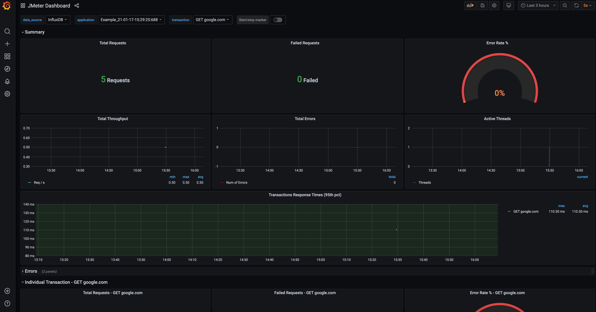
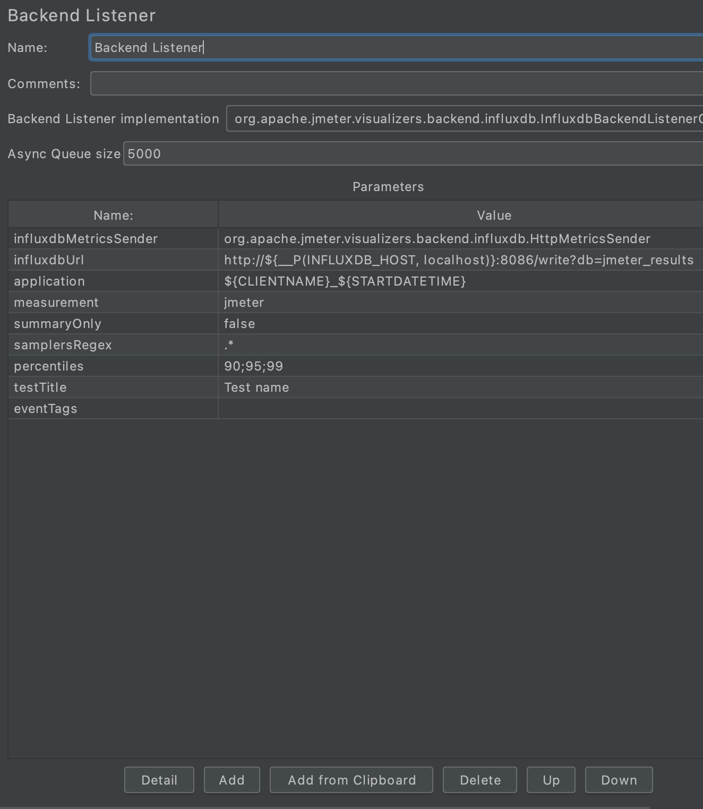
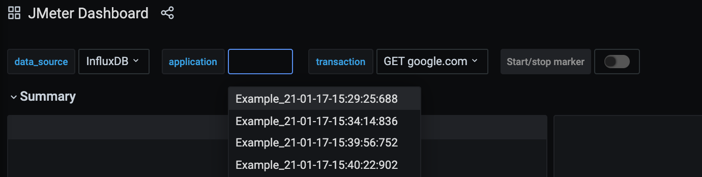

# JMeter InfluxDB Grafana Docker container

This is a container setup that allows you to immediately synchronize JMeter results with InfluxDB and visualize what is happening in realtime.

## Prerequisites
Ensure both docker and docker-compose are installed.

## Build JMeter docker image
`docker build -t jmeter jmeter-docker`

## Start InfluxDB and Grafana
`docker-compose up -d`

## Adjust JMeter script
Define 2 variables on the Test Plan component.

Name | Value
------------ | -------------
CLIENTNAME | Example
STARTDATETIME | `${__time(yy-MM-dd-HH:mm:ss:SSS)}`
	
Add & configure the Backend Listener in Jmeter.

Name | Value
------------ | -------------
influxdbMetricsSender  |  org.apache.jmeter.visualizers.backend.influxdb.HttpMetricsSender
influxdbUrl | http://${__P(INFLUXDB_HOST, localhost)}:8086/write?db=jmeter_results
application	| ${CLIENTNAME}_${STARTDATETIME}
measurement	| jmeter
summaryOnly	| false
samplersRegex | .*
percentiles	| 90;95;99
testTitle	| Test name
eventTags	| 

## Run JMeter script
`./run-specific-jmeter-script.sh example.jmx`

## Filter the correct testrun in Grafana

It is the concatenation of `CLIENTNAME` and `STARTDATETIME`.

## Disclaimer
Inspired by https://www.blazemeter.com/blog/make-use-of-docker-with-jmeter-learn-how
